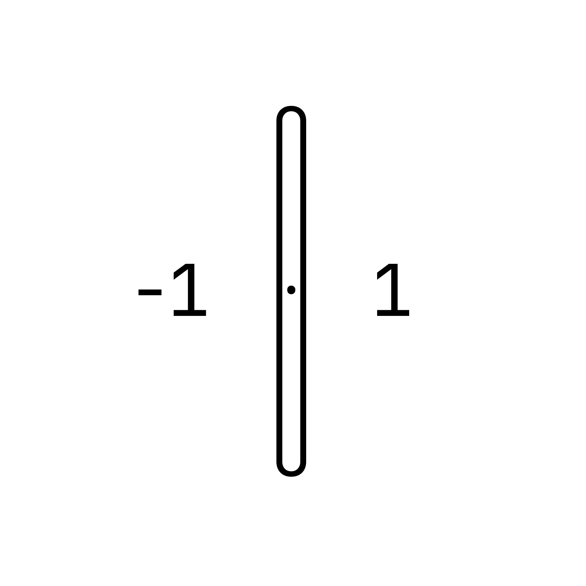

# rateself


<div style="text-align: center; margin: 10px;">
  
</div>

Minimalist daily rating app built in Flutter.  
Track your actions with just one tap: `-1`, `0`, or `1`. No clutter, no distractions.

## ✨ Features

- 🖱 One-tap daily ratings: -1, 0, or 1
- 🧮 Live total score for today
- 🔁 Undo support with smooth animation
- 🕛 Auto-reset at midnight
- 💥 Haptic feedback on rating
- 🧼 Clean, iOS-native design using `Cupertino` widgets  
- 💾 JetBrains Mono font for coding-style digits  

## 🚀 Getting Started

1. Clone the repo:
```bash
git clone https://github.com/yourusername/rateself.git
cd rateself
```

2. Install dependencies:
```bash
flutter pub get
```

3. Run on iOS:
```bash
flutter run
```

> Make sure [CocoaPods](https://guides.cocoapods.org/using/getting-started.html#installation) is installed if you use iOS